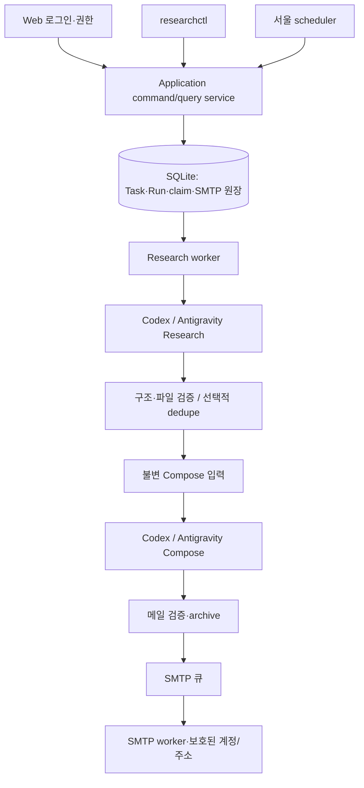

# 03. 아키텍처

`researchops/services`는 공통 명령·조회·권한·scheduler·worker를 담당합니다. `engine`은 실행 순서와 검증·archive를, `runners`는 native CLI·응답·MCP 감사·취득 transport를, `delivery`는 원문 패키지·SMTP·receipt·재시도를 담당합니다. `storage`는 schema·migration·repository, `web`과 `cli`는 표현 계층입니다.

Task마다 `project/`가 유지되고 phase별 staging을 새로 만듭니다. controller는 원본 입력·결과·hash·도구 진단을 run archive에 보존합니다. SQLite의 claim·lease·fencing이 중복 실행을 제어합니다. 경로 분리는 데이터 계약이며 production의 동일 UID 접근에 대한 OS 강제 격리 보증은 아닙니다.
